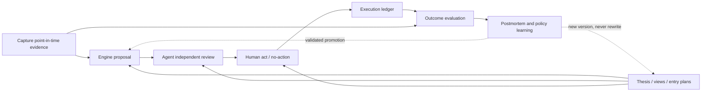

# Investment Assistant Refactor Plan

> Status: discussion baseline, not an implementation specification
>
> Scope: workflow, domain language, point-in-time data, decision records, rule engine, lenses,
> agent skills, evaluation, and maintenance standards
>
> Priority: evidence preservation > learning loop > action-list convenience
>
> Time convention: every wall-clock timestamp is UTC; exchange sessions remain market calendar dates

## 1. Purpose

The project started as a weekly rule engine and grew into a broader personal investment system. It
now collects market data that often cannot be backfilled, generates daily and weekly mechanical
proposals, creates live pre-trade briefs, records portfolio state, enriches reports with multiple
lenses, and evaluates earlier calls against later prices.

The useful product is no longer merely a report or a rule table. It is a **point-in-time, auditable
personal investment decision system** that must be able to answer five questions:

1. What information was legally available at the time?
2. What did the engine, agent, and human each believe or propose?
3. What final decision was made, including an explicit decision to do nothing?
4. What was actually executed?
5. What happened afterward, and why was the original reasoning right or wrong?

The refactor must preserve the project's practical usefulness while making those answers reliable.
It must not turn a personal tool into a distributed platform, generic workflow framework, or opaque
prediction system.

## 2. Product Constitution

These principles are architectural constraints. Later implementation choices must be rejected when
they violate them.

### 2.1 Investment assistance is the product

- The system supports investment decisions; it does not make autonomous trades.
- The engine produces a proposal, not an order or final truth.
- The agent is an independent analyst and explainer. It may endorse, challenge, or veto a proposal.
- The human owns the thesis, risk mandate, final act/no-action decision, and execution.
- A no-action decision is a first-class decision and must be recorded.

### 2.2 Evidence comes before interpretation

- Preserve the point-in-time evidence before generating reports or analysis.
- Raw, non-backfillable evidence is the highest-priority asset.
- Reports are disposable views; evidence and decisions are durable records.
- Missing or stale evidence must remain visible. Old data must never be copied and relabeled as a
  fresh capture.

### 2.3 History is append-only

- Engine proposals, agent reviews, human decisions, executions, and evaluations are immutable.
- Corrections create new records linked to the original; they do not rewrite the original.
- Same-session reruns are retained as separate vintages.
- The canonical historical prediction is selected by a deterministic policy, never by choosing the
  version that looks best after the outcome is known.

### 2.4 Different questions remain different objects

The system must not collapse the following into one `intent` or one generic label:

- long-term investment thesis;
- directional view over a declared horizon;
- entry or exit setup;
- engine proposal;
- agent analysis or veto;
- human final decision;
- execution;
- market outcome;
- postmortem.

Each has a different owner, time boundary, lifecycle, and evaluation rule.

### 2.5 Multiple horizons may coexist

A symbol can simultaneously have:

- an intact long-term core thesis;
- a bearish or neutral short-term directional view;
- an inactive entry plan because price is unattractive;
- a small right-side trading setup;
- a pre-trade decision for the next session.

Short-term technical weakness does not automatically invalidate a core thesis. Conversely, a valid
core thesis does not make every price a valid entry.

### 2.6 Simple technology, explicit contracts

- Prefer Markdown, YAML or NDJSON, raw Parquet artifacts, and Git.
- Do not introduce a database, event bus, orchestration framework, broker integration, or feature
  store until the plain-file workflow has demonstrated a concrete limitation.
- Complexity belongs in explicit domain rules and validation, not infrastructure.
- Schemas must be versioned even when the storage is plain text.

### 2.7 Lenses earn influence

- Every new lens starts as background context.
- A lens may enter shadow evaluation without affecting decisions.
- Only point-in-time, reproducible, out-of-sample evidence may make a lens eligible to influence
  confidence or sizing.
- Hard gates require a higher standard than sizing modifiers.
- Lens promotion and demotion are versioned policy changes.

## 3. Investment Domain Model

The refactor should use the following concepts as the stable language of the system. File names and
Python classes are secondary and may be decided later.

### 3.1 Core Thesis

A Core Thesis answers: **Why is this business worth owning over a long horizon?**

It belongs to the human and binds to a core portfolio sleeve, not to every possible trade in the
symbol.

Minimum fields:

- `thesis_id` and `version`;
- symbol and core sleeve reference;
- effective time and review date;
- core claim;
- key business drivers;
- point-in-time forward valuation range, including its fiscal-year basis;
- base, bull, and bear scenarios where appropriate;
- observable falsifiers or invalidation conditions;
- confidence;
- evidence references;
- relationship to the prior thesis version and reason for revision.

Rules:

- Price movement alone cannot silently rewrite the thesis.
- A technical break may pause adds, reduce exposure, or trigger a review without claiming that the
  business thesis is false.
- Forward valuation inputs must retain their original source and availability time because analyst
  estimates are revised later.
- A thesis update is append-only. Post-outcome edits must not be presented as the original thesis.

### 3.2 Directional View / Setup

A Directional View answers: **What is likely to happen over this declared horizon, and why?**

Minimum fields:

- `view_id`;
- symbol;
- mandate: `core`, `swing`, or `pretrade`;
- direction: bullish, bearish, neutral, or conditional;
- horizon or expiry;
- catalyst or mechanism;
- structural trigger;
- target or expected range when meaningful;
- invalidation condition;
- confidence;
- relationship to the core thesis: supports, neutral, or conflicts;
- evidence references.

Rules:

- A view expires or is explicitly closed. It must not remain indefinitely as a zombie opinion.
- A new horizon is a new view, not a revision of an old horizon.
- Conflicting views at different horizons are allowed and must be displayed rather than reconciled
  into a false single answer.

### 3.3 Entry Plan

An Entry Plan answers: **Under what conditions and at what size is it acceptable to assume risk?**

It links a thesis or directional view to a portfolio sleeve. It is not another thesis.

Minimum fields:

- `plan_id`;
- linked thesis/view;
- sleeve;
- total risk or capital budget;
- acceptable valuation range;
- acceptable price or structural zone;
- trigger and cancellation conditions;
- two to four conditional tranches;
- rules for a rebound before the planned position is complete;
- permitted implementation: shares or approved option expression;
- expiry or review date.

Default rebound rule:

> Add the next tranche only when the thesis remains intact, the relevant large-scale structure is
> confirmed, valuation remains reasonable, and portfolio budget permits it. If any condition fails,
> do not chase.

Tranches are a discipline, not a rigid formula. A `2-3-5`, `3-3-4`, or `5-3-2` plan must reflect
volatility, support spacing, trend, valuation, and the consequence of a rapid rebound. A tranche
should be triggered by new evidence rather than elapsed time alone.

### 3.4 Portfolio Sleeve

The minimum sleeve taxonomy is:

- `core`: long-duration ownership backed by a Core Thesis;
- `trading`: tactical risk backed by a Directional View or setup;
- `reserve`: low-risk, liquid capital reserved for approved future deployment.

Rules:

- Every fill is assigned to a sleeve before or at execution.
- A losing trading position cannot be retroactively reclassified as core.
- Core and trading sleeves may have independent targets and exits.
- Risk must also be aggregated by issuer, sector, factor, and option delta so sleeve separation cannot
  hide concentration.
- Reserve is not an invitation to create an unplanned equity position. Its benchmark should be an
  appropriate cash or short-duration instrument, not necessarily SPY.

### 3.5 Option Overlay

An Option Overlay answers: **How does an option position reshape an already approved risk mandate?**

Every overlay links to a sleeve, underlying position or approved entry plan, and a declared purpose:

- protection;
- income enhancement;
- risk-defined expression of an approved directional view;
- cash-secured execution of an approved entry plan.

Minimum fields:

- linked sleeve and plan/view;
- purpose;
- legs and expiry;
- maximum loss;
- secured cash or collateral;
- approximate net delta and notional exposure;
- upside cap and assignment consequences;
- exit, expiry, and roll rules.

Rules:

- Options cannot invent a thesis or bypass a sleeve risk limit.
- Covered calls can sell away core upside and must be evaluated as part of the combined position.
- Cash-secured puts are commitments to buy, not free income.
- LEAPS and spreads are directional risk, not harmless overlays.
- Whether CSP entry, LEAPS stock replacement, and new bull spreads qualify as “serving an existing
  position” remains an explicit open policy decision in Section 13.

### 3.6 Decision Episode

A Decision Episode is the primary audit unit. It links without merging:

`evidence -> engine proposal -> agent review/veto -> human act/no-action -> execution -> evaluation`

It also references the relevant thesis, view, plan, and sleeve. All later records append to the
episode; none rewrite its earlier stages.

## 4. Authority and Responsibility

### 4.1 Engine

The engine owns:

- deterministic point-in-time calculations;
- market and asset state classification;
- mechanical portfolio proposals;
- hard portfolio constraints;
- stable rule identifiers and structured trigger explanations;
- outcome calculations;
- exact replay under frozen inputs.

The engine does not own:

- a company's long-term thesis;
- unverified catalysts;
- the final action;
- automatic execution;
- retrospective reinterpretation of a proposal.

### 4.2 Agent

The agent owns:

- interpreting structured evidence;
- sourcing and time-bounding catalysts;
- identifying conflicts across horizons and lenses;
- challenging rule outputs;
- issuing an endorsement, caution, or veto;
- explaining what evidence would change its view.

The agent must not:

- modify raw evidence;
- silently introduce a new mechanical rule;
- expand risk beyond an approved human mandate;
- replace a structured record with prose only;
- use post-cutoff information in a point-in-time judgment.

Default veto semantics:

- A veto changes the proposal to `blocked_pending_explicit_override`.
- The human retains final authority but must explicitly override the veto and record a reason.
- Data-integrity and hard-risk violations may eventually become absolute blocks, subject to the open
  policy decision in Section 13.

### 4.3 Human

The human owns:

- Core Theses and their revisions;
- mandate, horizon, sleeve, and risk budget;
- final act or no-action decision;
- explicit overrides;
- execution and manual ledger maintenance;
- interpretation of personal constraints not observable by the system.

## 5. Point-in-Time Data Standard

### 5.1 Required event envelope

Every durable record has a small common envelope:

- `id`;
- `type`;
- `schema_version`;
- `profile`;
- `symbol` or market-wide `scope`;
- `mandate` and `horizon` where applicable;
- `market_session` where applicable;
- `available_at`;
- `recorded_at`;
- `run_id`;
- references to parent records and evidence;
- `status`;
- `provenance`.

Do not force every lens payload into one universal schema. Standardize the envelope and references;
allow each evidence type to own its payload schema.

### 5.2 Time vocabulary

Only the following concepts should be used:

- `market_session`: exchange calendar date for session-bound data;
- `source_event_at`: when a news item, release, transaction, or source event occurred;
- `available_at`: earliest UTC time the information could legally be known by the decision process;
- `recorded_at`: UTC time the project persisted the record;
- `knowledge_cutoff_at`: the run's declared UTC knowledge boundary.

Invariant:

> Every evidence record referenced by a judgment must satisfy
> `evidence.available_at <= run.knowledge_cutoff_at`.

Market bar dates and option expiries remain calendar dates. All wall-clock timestamps use the
project's explicit UTC representation and `quant/clock.py` convention.

### 5.3 Minimal durable record types

The initial event model needs only five record types:

1. `run`: workflow, cutoff, code/config/input references, status, and capture manifest;
2. `evidence`: source, event/availability time, raw artifact hash/reference, freshness;
3. `judgment`: engine proposal, agent analysis/veto, human decision, or postmortem;
4. `execution`: order, fill, no-fill, fee, time, and sleeve allocation;
5. `evaluation`: evaluator version, horizon, price evidence, metrics, and dimensional verdicts.

Theses, views, and entry plans may use the same append-only envelope but retain their distinct domain
schemas.

### 5.4 Provenance

A run must bind to:

- code commit and dirty-worktree status or content hash;
- validated strategy version;
- config hash;
- portfolio/watchlist/options/ledger Git reference or content hash;
- profile;
- provider and request parameters for captured evidence;
- raw payload hash and storage reference;
- schema and lens versions;
- capture result for every expected lens and symbol.

A Git SHA plus config hash alone is not sufficient to replay a historical decision when portfolio
inputs and provider payloads have changed.

## 6. Immutability, Revision, and Canonical Selection

### 6.1 Append-only rules

- Never overwrite, delete, or edit a durable historical record.
- A correction creates a new record with `revision_of` and `revision_reason`.
- A changed mandate or horizon creates a new judgment rather than a revision.
- A postmortem may reference outcomes but can never replace the original forecast label.
- Git history is an additional audit layer, not a substitute for explicit record identity.

### 6.2 Same-session reruns

All runs are retained. The canonical engine proposal for evaluation is computed as follows:

1. group by profile, workflow, market session, symbol, mandate, and horizon;
2. remove runs that violate the knowledge cutoff or mandatory session-consistency checks;
3. select the earliest recorded proposal generated within the workflow's valid window;
4. retain every later vintage as a revision or independent rerun;
5. never select a later vintage because its outcome is better.

Only a documented data-integrity invalidation may disqualify the first otherwise eligible proposal.
The next eligible proposal is then selected deterministically.

The canonical human decision should normally be the final explicit decision before the relevant
execution/no-action deadline. Earlier changes remain visible.

### 6.3 Existing v1 data

- Preserve the current observation and raw-snapshot stores unchanged as a read-only legacy archive.
- Do not silently repair or overwrite mixed-session and duplicate historical rows.
- A migration should generate a separate v2 store plus an audit report describing exclusions,
  duplicates, inferred fields, and records that cannot be made point-in-time valid.
- Existing data with uncertain availability time may be useful for exploration but must not be
  promoted to clean training data.

## 7. Freshness, Missing Data, and Degraded Runs

### 7.1 Evidence freshness

Each expected evidence item has one of four states:

- `fresh`: acquired for this run and its source/availability time is verified;
- `stale`: an earlier evidence record is explicitly reused by reference;
- `missing`: the source legitimately supplied no data or the item was not available;
- `error`: data was expected but acquisition or validation failed.

Stale evidence retains its original `available_at`, `recorded_at`, and payload identity. A new run may
reference it; it must not write a copied payload carrying today's timestamp.

### 7.2 Run status

- `complete`: core evidence and expected optional evidence succeeded;
- `degraded`: core evidence is valid but optional evidence is stale, missing, or errored;
- `failed`: core evidence, input snapshot, knowledge cutoff, or session consistency is invalid.

Every run, including a failed run, retains a capture manifest describing expected, acquired, reused,
missing, and failed items.

### 7.3 Core versus optional evidence

Initial working assumption:

- final session OHLCV for the evaluated symbol/universe and benchmark;
- portfolio/input snapshot;
- declared market session and valid knowledge cutoff;

are core evidence. Other lenses are optional until explicitly promoted. Whether VIX and both SPY/QQQ
must be mandatory is an open decision.

## 8. Lens Lifecycle

Every lens has a declared status.

### 8.1 Context

- Available to reports, agents, and humans.
- Cannot change engine state, intent, sizing, or eligibility.
- Must still expose provenance, freshness, and missingness.

### 8.2 Shadow

- Has a preregistered hypothesis, direction, horizon, evaluation metric, and missing-data policy.
- Is recorded prospectively.
- Does not affect live decisions.
- Is evaluated against the same point-in-time discipline as the engine.

### 8.3 Engine-eligible

Promotion requires:

- archivable point-in-time raw inputs;
- known availability lag and cutoff rules;
- no look-ahead leakage;
- incremental value under walk-forward/out-of-sample evaluation;
- stability across relevant regimes;
- realistic costs where it changes action;
- a live shadow period;
- explicit degraded behavior;
- versioned approval and rollback criteria.

First promotion should normally permit a confidence or sizing modifier. A hard gate requires stronger
evidence. A lens can be demoted when monitoring shows decay.

## 9. Outcome and Evaluation Standard

Do not reduce an episode to one boolean `hit`. Evaluation is dimensional.

### 9.1 Market value added

Primary portfolio objective:

- symbol forward return;
- benchmark return over the identical executable horizon;
- alpha versus SPY or the mandate-specific benchmark.

A 60-day bullish call that gains 20% after first falling 10% is directionally correct. Its path and
relative value are recorded separately. If SPY gained more than 20%, report “direction correct, no
value added” rather than forcing a single overall verdict.

### 9.2 Path and drawdown

Record:

- direction correctness;
- maximum favorable excursion;
- maximum adverse excursion;
- drawdown magnitude;
- drawdown-budget breach;
- recovery time where meaningful.

“Avoid maximum drawdown” must become a declared drawdown budget and breach rule, not a vague score.

### 9.3 Risk-adjusted result

Store the relevant return/risk and return/drawdown measures. Do not prematurely combine them into a
single optimization score.

### 9.4 Decision and execution quality

Separately record:

- whether the human adopted, modified, or rejected the proposal;
- explicit no-action;
- fill/no-fill and cost;
- adherence to sleeve, tranche, budget, and invalidation rules;
- opportunity cost and avoided risk for no-action.

Execution discipline must not retroactively alter whether an engine or agent forecast was accurate.

### 9.5 Benchmark by mandate

SPY alpha is the default portfolio-level priority, not necessarily the correct benchmark for every
object:

- core: SPY and, where helpful, an industry benchmark;
- swing/pretrade: the benchmark over the declared trade horizon;
- reserve: cash or short-duration Treasury proxy;
- option overlay: the identical underlying position without the overlay;
- protection: avoided loss and cost relative to the unprotected position.

## 10. Target Workflows and SOPs

The target system is a sequence of small workflows sharing records, not one giant pipeline with mode
flags.

### 10.1 Daily post-close capture

Purpose: preserve evidence first and create a daily point-in-time episode.

1. Resolve the expected exchange session independently of UTC calendar date.
2. Freeze profile inputs and capture their Git/content references.
3. Capture mandatory price/benchmark evidence.
4. Capture each non-backfillable lens independently.
5. Persist raw evidence and the capture manifest before analysis.
6. Validate session consistency and knowledge cutoff.
7. Mark the run complete, degraded, or failed.
8. Generate engine proposals only from eligible evidence.
9. Run agent review and persist structured analysis/veto.
10. Record the human's final decision or no-action by the declared deadline.

The workflow must support partial success. One lens failure must not erase successful evidence, but a
failed core condition must prevent a valid canonical proposal.

### 10.2 Thesis maintenance

Purpose: maintain slow-moving investment beliefs without rewriting them in response to price noise.

Trigger only on:

- earnings or material company disclosures;
- a thesis falsifier;
- a meaningful change in point-in-time forward estimates;
- a scheduled review date;
- a human-declared material event.

Output a new thesis version or an explicit “reviewed, unchanged” event.

### 10.3 Weekly portfolio review

Purpose: create or update directional views, plans, and portfolio proposals.

1. Load the current canonical evidence, thesis versions, open views, plans, sleeves, and ledger.
2. Close or expire stale views.
3. Generate the mechanical portfolio proposal through the same policy used by replay.
4. Review horizon conflicts, concentration, valuation, catalysts, and option exposure.
5. Let the agent endorse, challenge, or veto with cited evidence.
6. Record prioritized human actions and explicit no-actions.
7. Create or revise entry plans without rewriting old plans.

The output is a decision record first and a Markdown report second.

### 10.4 Pre-trade check

Purpose: decide whether an already contemplated action is valid now.

1. Require a linked view/plan and intended sleeve.
2. Refresh live quote, event calendar, structure, and portfolio budget as new evidence.
3. Re-evaluate catalyst and thesis consistency.
4. Check whether price/valuation, trigger, tranche, and aggregate risk remain valid.
5. Produce one of: execute, stage, wait, cancel, or no-action.
6. Persist agent veto or endorsement and the human decision.
7. Record the actual fill or no-fill later.

Pretrade must not manufacture a new long-term thesis to justify an impulsive trade.

### 10.5 Execution reconciliation

Purpose: keep a simple source of truth for positions and decisions.

- Manually append orders, fills, fees, sleeve allocations, and no-fills in a structured text ledger.
- Commit the ledger to the local private Git repository.
- Derive current positions and cash from the ledger, with an explicit reconciliation event when they
  differ from the broker statement.
- Broker automation is out of scope until manual maintenance becomes a demonstrated bottleneck.

### 10.6 Deferred evaluation

Purpose: evaluate only after a declared horizon matures.

1. Select canonical historical proposals and decisions using the fixed vintage policy.
2. Enforce the original knowledge cutoff.
3. Use the executable start price, not the signal bar's unavailable close.
4. Compute mandate-specific benchmark, alpha, path, risk, and discipline dimensions.
5. Append an evaluation with evaluator version and price evidence references.
6. Keep engine, agent, human, and execution evaluations separate.

### 10.7 Postmortem and learning

Purpose: explain error without introducing hindsight into the original record.

For each material miss or unexpected success:

- reconstruct only the original evidence set;
- state which assumption failed;
- classify the error: missing evidence, bad data, thesis error, horizon error, rule error, sizing
  error, execution error, or irreducible uncertainty;
- separately note later information that was not knowable at the time;
- propose a testable change, not an immediate rule addition;
- route new lens ideas through Context -> Shadow -> Engine-eligible.

## 11. Rules and Configuration Standards

### 11.1 Rule contract

Every mechanical rule must have:

- stable `rule_id`;
- version;
- purpose and economic rationale;
- required inputs;
- mandate and horizon;
- trigger and precedence;
- proposed action;
- missing/degraded behavior;
- structured explanation fields;
- replay coverage and tests.

Skills and reports must consume the structured trigger explanation. They must not duplicate rule
definitions in prose and gradually drift from the implementation.

### 11.2 Policy parity

- Live and replay invoke the same policy surface for holding decisions, closes, released slots,
  watchlist entries, rotation, sizing, and portfolio constraints.
- Replay supplies point-in-time inputs and an execution model; it does not reimplement live policy.
- A parity fixture must prove that identical frozen inputs produce identical proposals.
- Human and agent judgment remains outside the mechanical backtest unless a separately defined shadow
  or policy model makes it reproducible.

### 11.3 Configuration boundaries

The current monolithic config conceptually separates into validated domains:

- strategy policy and rule thresholds;
- portfolio mandate and risk limits;
- data acquisition and provider settings;
- lens lifecycle/status;
- presentation preferences;
- agent review policy.

This is a semantic separation first. It does not require immediately creating six files. Each domain
must eventually have a schema, validation, defaults, and version semantics.

A strategy version changes when proposal behavior can change. Presentation-only changes must not
create a new strategy version. Input/portfolio changes receive their own references rather than being
misrepresented as strategy changes.

### 11.4 Hard constraints versus judgment

Hard constraints should remain few and explicit, such as:

- invalid or future evidence;
- unavailable capital or collateral;
- issuer/sleeve risk limits;
- invalid session or stale mandatory market data;
- impossible option coverage.

Valuation, catalyst interpretation, technical quality, and lens conflicts are normally proposal or
review inputs until evidence justifies a hard rule.

## 12. Agent Skill Standard

Agent skills are workflow adapters, not a second hidden rule engine.

Each skill must declare:

- workflow and required input record types;
- allowed point-in-time evidence and cutoff;
- mandatory source verification;
- expected structured output;
- whether it may veto;
- prohibited actions;
- skill/prompt version;
- degraded behavior;
- evaluation criteria.

Skills should output a Judgment record containing:

- actor and skill version;
- parent engine proposal;
- evidence references;
- endorsement, caution, or veto;
- thesis relationship;
- direction and horizon where applicable;
- confidence when useful;
- invalidation/change conditions;
- concise rationale and source references.

Markdown prose is a rendered view of this record. Appending prose to a report without updating the
structured decision history is not sufficient.

## 13. Open Policy Decisions

The following questions must be answered before their related implementation is finalized.

### 13.1 Workflow cutoffs

- What exact UTC `knowledge_cutoff_at` and valid generation window applies to daily post-close?
- What is the weekly review cutoff?
- What is the pretrade final-decision/no-action deadline?
- How should early-close sessions and holidays alter these windows?

### 13.2 Mandatory evidence

- Are final OHLCV, portfolio/input snapshot, and benchmark sufficient as core evidence?
- Must VIX, SPY, and QQQ all be fresh for a proposal to be canonical?
- Does a missing point-in-time forward valuation block a core entry decision or merely degrade it?

### 13.3 Default horizons

- What is the normal evaluation horizon for a Core Thesis?
- What are the default horizons for swing and pretrade views?
- May a view declare multiple horizons, or should each horizon always be a separate view?

### 13.4 Risk budgets

- What drawdown budget applies to the total portfolio and each sleeve?
- What concentration limits apply by issuer, sector, and correlated factor?
- What amount of reserve must remain callable?

### 13.5 Agent veto

- Is veto always a soft block requiring explicit human override?
- Which conditions, if any, are absolute blocks: invalid evidence, unknown catalyst, stale data,
  collateral failure, or risk-budget breach?

### 13.6 Option boundary

- Are CSPs permitted only when an approved entry tranche already exists?
- Are LEAPS permitted as stock replacement inside an existing sleeve?
- Are bull spreads permitted for a new directional view without underlying shares?
- Must option-adjusted delta always remain inside the sleeve and issuer limits?

### 13.7 Thesis evidence

- Which point-in-time sources are acceptable for forward estimates and fundamentals?
- What is the default thesis review cadence?
- How many concrete falsifiers are required?
- Which valuation metrics supplement forward P/E for cyclical or high-growth businesses?

## 14. Refactor Sequence

This is the single implementation plan. Each phase has an observable exit criterion. Later phases
must not begin merely because earlier code was rearranged.

### Phase 0: Freeze semantics and protect current assets

Deliverables:

- approve this constitution and resolve the blocking questions in Section 13;
- document the legacy stores as read-only;
- inventory current workflows, schemas, and known contamination;
- define backup and restore procedure for non-backfillable data;
- record the current failing-test baseline separately from refactor regressions.

Exit criteria:

- agreed vocabulary for thesis, view, plan, proposal, decision, execution, and evaluation;
- no implementation work can silently redefine those terms;
- current raw evidence has a verified backup.

### Phase 1: Establish the point-in-time foundation

Deliverables:

- versioned event envelope and five minimal record types;
- exchange-session resolver separate from UTC today;
- run identity, cutoff, input references, and capture manifest;
- append-only storage and revision links;
- explicit fresh/stale/missing/error semantics;
- deterministic canonical-vintage selector;
- validations for mixed sessions, duplicates, future evidence, and false freshness.

Exit criteria:

- a post-close run after UTC midnight binds to the correct US market session;
- no same-session rerun overwrites an earlier proposal;
- stale provider data can only be referenced as stale;
- a run can be reconstructed from its input and evidence references;
- intentional tests reproduce the current mixed-session and overwrite bugs and pass under v2.

### Phase 2: Separate capture, proposal, review, and rendering workflows

Deliverables:

- evidence capture completes and persists before analysis;
- engine consumes a frozen evidence bundle with no hidden provider calls;
- lenses consume frozen inputs rather than owning workflow/network behavior;
- reports render records without becoming the source of truth;
- partial lens failure produces a degraded run and complete manifest.

Exit criteria:

- capture can run without generating a report;
- proposal generation can replay entirely from frozen evidence;
- report regeneration performs no network calls;
- adding an optional lens does not require changing the central context constructor or unrelated
  tests.

### Phase 3: Unify live and replay policy

Deliverables:

- one mechanical portfolio policy surface;
- stable rule identifiers and structured trigger traces;
- shared handling of closes, released slots, rotation, entry, sizing, and constraints;
- clean execution timing from decision close to next executable price;
- parity and truncation tests.

Exit criteria:

- frozen live inputs and replay inputs produce identical proposals;
- no default differs between live and replay;
- every mechanical proposal identifies the rules and inputs that produced it;
- the full test suite passes before behavioral tuning begins.

### Phase 4: Introduce thesis, view, plan, and sleeve records

Deliverables:

- versioned Core Thesis format;
- expiring Directional View format;
- conditional Entry Plan and tranche format;
- core/trading/reserve sleeve mandates and aggregate risk view;
- migration path from freeform portfolio plans without rewriting their history.

Exit criteria:

- one symbol can hold concurrent core, swing, and pretrade views without collision;
- a proposal names its mandate, horizon, sleeve, and linked plan;
- a tactical loss cannot be silently converted into a core position;
- forward valuation evidence retains its original time and source.

### Phase 5: Build the decision and execution journal

Deliverables:

- structured engine proposal;
- structured agent analysis/veto;
- structured human final decision including no-action;
- simple manual text/Git execution ledger;
- reconciliation between derived portfolio and broker snapshot;
- complete Decision Episode view.

Exit criteria:

- every contemplated action can be traced through proposal, review, decision, and fill/no-fill;
- an agent veto requires a visible explicit override;
- reports and chats are reproducible from structured records;
- current portfolio state can be derived or explicitly reconciled from the ledger.

### Phase 6: Rebuild evaluation around declared questions

Deliverables:

- mandate-specific horizons and benchmarks;
- executable-price outcome calculation;
- alpha, direction, MFE, MAE/drawdown, recovery, risk-adjusted, and discipline dimensions;
- separate evaluations for engine, agent, human, execution, and option overlay;
- no-action opportunity-cost evaluation;
- evaluator versions and immutable results.

Exit criteria:

- the same outcome cannot retroactively alter an original judgment;
- “direction correct but SPY alpha negative” is representable without contradiction;
- Add Core followed by -10% then +20% retains both direction success and adverse path;
- duplicate or invalid legacy samples cannot enter clean scorecards silently.

### Phase 7: Govern lenses and agent skills

Deliverables:

- Context/Shadow/Engine-eligible registry;
- preregistration template for lens hypotheses;
- promotion, monitoring, rollback, and demotion rules;
- skills that consume rule traces and emit structured judgments;
- prompt/skill versions connected to Decision Episodes and evaluation.

Exit criteria:

- no lens influences live policy without an approved versioned promotion record;
- skill prose cannot drift from mechanical rule definitions unnoticed;
- agent judgment quality can be evaluated independently of engine quality;
- removing an optional lens does not break the core decision workflow.

### Phase 8: Simplify physical code and file structure

Only after the domain and workflow boundaries have stabilized:

- organize code around evidence acquisition, domain policy, workflows, records, evaluation, and
  rendering;
- split oversized provider and pipeline modules along proven ownership boundaries;
- split configuration according to validated semantic domains where it improves operation;
- remove compatibility paths created only by completed migrations;
- rewrite architecture and SOP documentation to describe the actual system.

Exit criteria:

- every directory has one reason to change;
- dependencies flow from workflows toward domain interfaces, not from domain policy toward providers;
- no large context object grows whenever a lens is added;
- documentation, tests, skills, and runtime share the same rule and schema versions.

## 15. Development and Maintenance Priorities

Future development should concentrate on these areas, in order:

1. **Evidence integrity**: capture reliability, point-in-time timestamps, manifests, backups, and data
   quality checks.
2. **Decision semantics**: thesis/view/plan/proposal/decision/execution distinctions and stable IDs.
3. **Policy parity**: one deterministic mechanical policy for live and replay.
4. **Portfolio truth**: sleeve-aware manual ledger, reconciliation, and aggregate risk.
5. **Evaluation quality**: correct vintages, horizons, benchmarks, paths, and evaluator versions.
6. **Lens governance**: shadow testing and disciplined promotion rather than feature accumulation.
7. **Agent quality**: sourced point-in-time analysis, explicit veto, and measurable judgment records.
8. **Presentation**: reports should improve clarity but remain replaceable views.

The following are not near-term priorities:

- autonomous trading;
- ML meta-models before clean point-in-time outcomes exist;
- adding more lenses before capture and evaluation contracts stabilize;
- generic plugin/workflow frameworks;
- a database solely to make the architecture appear mature;
- parameter optimization on the contaminated legacy panel;
- broad code cleanup unrelated to the staged refactor.

## 16. Global Acceptance Criteria

The refactor is successful when:

- every material decision can be replayed using only information available at its cutoff;
- raw evidence cannot be overwritten or falsely refreshed;
- same-session reruns and revisions remain auditable;
- engine, agent, and human judgments remain distinct;
- act, no-action, fill, and no-fill are all represented;
- core, swing, and pretrade views coexist without semantic collision;
- live and replay mechanical proposals have parity;
- lens failures degrade visibly without destroying successful captures;
- evaluation distinguishes alpha, direction, path, risk, and discipline;
- the system remains operable through simple text files, Parquet artifacts, and Git;
- adding a lens does not require widening a universal table or editing every workflow;
- the project helps the investor act with less FOMO and more explicit, reviewable discipline.

## 17. Non-goals

This plan does not authorize:

- changing current investment rules or thresholds;
- deleting or rewriting legacy data;
- selecting a final package/directory layout before workflow boundaries stabilize;
- training a predictive model;
- promoting any current lens into the engine;
- connecting to a broker;
- replacing human judgment with the agent;
- claiming an investment edge before point-in-time out-of-sample evaluation supports it.

---

This document should be revised through explicit decisions. When a policy in Section 13 is resolved,
record the decision, rationale, effective date, and affected workflow; do not silently alter the
constitution to fit an implementation shortcut.
